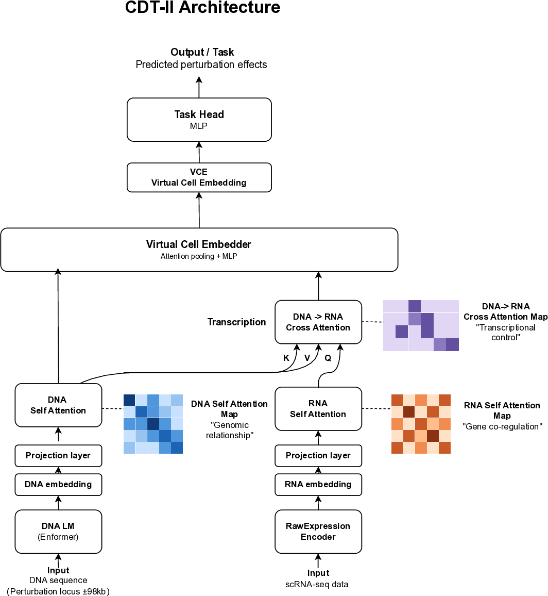

# Central Dogma Transformer II (CDT-II)

**An AI Microscope for Understanding Cellular Regulatory Mechanisms**

[](https://arxiv.org/abs/2602.08751)

## Overview

CDT-II is an "AI microscope" whose attention maps are directly interpretable as regulatory structure. By mirroring the central dogma in its architecture, each attention mechanism corresponds to a specific biological relationship:

- **DNA self-attention**: Genomic relationships
- **RNA self-attention**: Gene co-regulation
- **DNA-to-RNA cross-attention**: Transcriptional control



**Figure 1.** CDT-II architecture and interpretable attention maps. The model processes genomic DNA (via Enformer) and per-cell RNA expression, producing attention maps that directly correspond to biological relationships.

## Key Results

| Metric | Value |
|--------|-------|
| Overall validation r | 0.64 |
| Per-gene mean r | 0.84 |
| GFI1B network enrichment | 6.6× (P=3.5×10⁻¹⁷) |
| RNA processing module | P=1×10⁻¹⁶ |
| Gradient-based attribution | r=0.83 |

## Paper

- **CDT-II**: [arXiv:2602.08751](https://arxiv.org/abs/2602.08751)
- **CDT v1**: [arXiv:2601.01089](https://arxiv.org/abs/2601.01089)

## Repository Structure

```
CDT2/
├── data/                   # TSS coordinates and metadata
├── docs/                   # Paper manuscript (.tex, .pdf)
├── figures/main/           # All figures
└── notebooks/
    ├── embeddings/         # Embedding generation
    │   └── Morris_28genes_Enformer.ipynb
    ├── training/           # Model training
    │   └── CDT_Morris_CRISPRi_CellLevel_Training.ipynb
    └── analysis/           # Results analysis
        ├── CDT_Morris_Prediction_Analysis.ipynb
        ├── CDT_Morris_Attention_Analysis.ipynb
        ├── fig2_ablation_study.ipynb
        ├── fig4a_dna_self_attention.ipynb
        ├── fig5b_go_enrichment.ipynb
        └── fig6_encode_validation.ipynb
```

## Notebooks

| Notebook | Description |
|----------|-------------|
| `Morris_28genes_Enformer` | Enformer embedding generation for 28 target gene TSSs |
| `CellLevel_Training` | CDT-II model training on Morris STING-seq data |
| `Prediction_Analysis` | Per-gene prediction performance (r=0.84) |
| `Attention_Analysis` | GFI1B regulatory network from attention maps |
| `fig2_ablation_study` | Ablation study (Fig 2) |
| `fig4a_dna_self_attention` | DNA self-attention analysis (Fig 4A) |
| `fig5b_go_enrichment` | GO enrichment comparison (Fig 5B) |
| `fig6_encode_validation` | ENCODE validation (Fig 6) |

## Using CDT-II with Your Own Data

CDT-II can be applied to any CRISPRi screen with single-cell RNA-seq readout.

### What You Need

1. **CRISPRi perturbation data** — Single-cell RNA-seq with guide assignments (e.g., STING-seq, Perturb-seq, CROP-seq)
2. **Target gene TSS coordinates** — Chromosome and position (hg38)
3. **Google Colab with GPU** (recommended) or a local GPU

### Pipeline

| Step | Notebook | What It Does |
|------|----------|-------------|
| 1 | `embeddings/Morris_28genes_Enformer.ipynb` | Generate Enformer embeddings for your target gene TSSs |
| 2 | `training/CDT_Morris_CRISPRi_CellLevel_Training.ipynb` | Train CDT-II on your perturbation data |
| 3 | `analysis/CDT_Morris_Prediction_Analysis.ipynb` | Evaluate prediction accuracy per gene |
| 4 | `analysis/CDT_Morris_Attention_Analysis.ipynb` | Extract and interpret attention maps |

### Input Data Format

CDT-II expects two HDF5 files:

**1. Enformer embeddings** (generated by `Morris_28genes_Enformer.ipynb`)
```
embeddings:  [n_genes, 896, 3072]   # Enformer trunk embeddings per TSS
gene_names:  [n_genes]               # Gene symbols
tss_coords:  [n_genes]               # TSS genomic positions (hg38)
```

**2. Cell-level perturbation effects**
```
cell_expr:        [n_cells, n_genes]  # Per-cell expression (log1p CPM)
log2fc:           [n_cells, n_genes]  # Per-cell log2 fold change vs control
target_gene_idx:  [n_cells]           # Which gene was perturbed in each cell
gene_names_cdt:   [n_genes]           # Gene symbols (must match Enformer file)
target_gene_names: [n_targets]        # Perturbation target gene names
ntc_mean_expr:    [n_genes]           # Non-targeting control mean expression
train_genes:      [n_train]           # Genes for training
val_genes:        [n_val]             # Genes for validation (held out)
```

The key idea: `cell_expr` is the **input** (cellular state) and `log2fc` is the **output** (perturbation effect). Each cell is a unique sample with its own expression profile.

### Preparing Your Own Data

Starting from a CRISPRi screen with scRNA-seq (e.g., 10x Genomics):

1. **Assign guides to cells** — Use your screen's barcode/guide assignment to label each cell with its perturbation target
2. **Identify NTC cells** — Non-targeting control cells serve as the baseline
3. **Normalize expression** — Convert raw UMI counts to CPM (counts per million), then `log1p`: `cell_expr = log(CPM + 1)`
4. **Compute NTC baseline** — Average expression across all NTC cells: `ntc_mean_expr = mean(NTC_cell_expr, axis=0)`
5. **Compute log2 fold change** — For each perturbed cell: `log2fc = log2((cell_CPM + 1) / (NTC_mean_CPM + 1))`
6. **Filter genes** — Keep genes that show reproducible perturbation effects across independent experiments (see ablation study). Quality over quantity.
7. **Split train/val by gene** — Hold out a few perturbation target genes entirely for validation. CDT-II's power is predicting effects of **unseen** perturbations.

Standard scRNA-seq tools (Scanpy, Seurat) handle steps 1-3. Steps 4-6 are specific to perturbation analysis. See the training notebook for the expected data structure.

### Tips

- Start with the executed notebooks to understand expected outputs
- Gene filtering by cross-dataset reproducibility improves results (see ablation study: 2,361 filtered genes vs 9,335 unfiltered)
- Enformer embeddings are cell-type-agnostic — you only need to regenerate them if your target genes differ
- TSS coordinate file (`data/morris_28genes_tss.csv`) is included in the repository

### Swapping the DNA Foundation Model

CDT-II's DNA embedding module is deliberately modular. While we use Enformer in this work, it can be replaced with newer DNA foundation models such as [AlphaGenome](https://deepmind.google/discover/blog/alphagenome-ai-for-better-understanding-the-genome/) or [Evo](https://arcinstitute.org/news/evo). The key requirement is that the replacement model provides per-position embeddings along the genomic axis:

```
Current:  Enformer  DNA (196kb) → [896, 3072]  (128bp bins, trunk embeddings)
Swap to:  Any model DNA (input)  → [n_bins, embed_dim]  (per-position embeddings)
```

AlphaGenome uses a different architecture (U-Net + Transformer, 1Mb input, multi-resolution output) so its intermediate representations will need to be extracted and reshaped. **For practical use today, we recommend extracting the ±98kb region around the TSS at 128bp resolution to match the current [896, embed_dim] format.** This keeps GPU memory requirements manageable (self-attention scales quadratically with sequence length) and the current 196kb window already achieves strong results (mean r = 0.84).

To adapt a new model: (1) extract per-position embeddings at 128bp resolution for the TSS-centered region, (2) update `dna_dim` and `dna_seq_len` in `CDTCRISPRiConfig`, and (3) update the `SequenceProjector` input dimension. The rest of the pipeline works unchanged.

CDT-II uses Flash Attention (`torch.nn.functional.scaled_dot_product_attention`) throughout, so extending to longer sequences in the future — as GPU memory grows — is straightforward.

## Data

Data files are hosted on Hugging Face:

**[nobusama17/CDT2-data](https://huggingface.co/datasets/nobusama17/CDT2-data)**

| File | Description | Size |
|------|-------------|------|
| `morris_celllevel_effects_2361.h5` | Cell-level perturbation effects (TSS) | 41 MB |
| `morris_snp_celllevel_effects_2361.h5` | Cell-level perturbation effects (SNP) | 34 MB |
| `k562_gene_embeddings_aligned.h5` | Gene embeddings from scGPT | 4.4 MB |
| `cdt_morris_celllevel_best.pt` | Trained model weights | 80 MB |
| `morris_28genes_enformer.h5` | Enformer embeddings for 28 TSS genes | 277 MB |
| `morris_snp_enformer.h5` | Enformer embeddings for SNP loci | 4.8 GB |

### Quick Start

The analysis notebooks automatically download data from Hugging Face when running locally:

```python
# Notebooks detect environment and download data automatically
# On Colab: uses Google Drive
# Locally: downloads from Hugging Face

from huggingface_hub import hf_hub_download
model_path = hf_hub_download(
    repo_id="nobusama17/CDT2-data",
    filename="cdt_morris_celllevel_best.pt",
    repo_type="dataset"
)
```

All files including Enformer embeddings are available on Hugging Face and will be downloaded automatically by the notebooks.

## Requirements

- Python 3.9+
- PyTorch 2.0+
- huggingface_hub
- Google Colab (recommended for training and Enformer embedding generation)

## Future Direction

CDT-III is in early planning. Two key directions are being explored:

- **Epigenomic integration** — Incorporating chromatin accessibility, histone modifications, and DNA methylation into the Central Dogma framework, enabling the model to capture the regulatory layers between genome and transcriptome.
- **Drug discovery applications** — Extending CDT's interpretable multi-modal architecture toward predicting and understanding drug responses at the cellular level.

## Citation

```bibtex
@article{ota2026cdtii,
  title={Central Dogma Transformer II: An AI Microscope for Understanding Cellular Regulatory Mechanisms},
  author={Ota, Nobuyuki},
  journal={arXiv preprint arXiv:2602.08751},
  year={2026}
}
```

## License

MIT License

## Author

Nobuyuki Ota
Independent Researcher, Burlingame, CA, USA
nobuyuki.ohta@gmail.com
